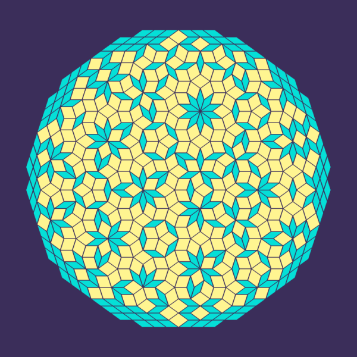
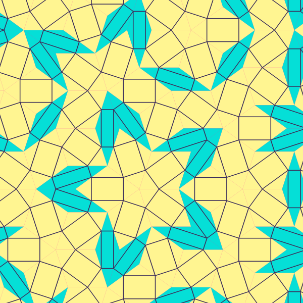

# Penrose

Penrose (and Penrose-like) tiling generation with numpy, using de Bruijn's multigrid method. 
Visualisation with Pillow. Experiments and interactive stuff (hopefully).



## Usage

To generate the original Penrose two-rhomb tiling, simply run

```
python3 examples/original-tiling.py
```

There are more examples to get inspired by in the `examples` folder.





### RESOURCES

All of these build mostly on N. G. de Bruijn's work.

- [M. W. Reinsch - Lattice representations of Penrose tilings of the plane (1999)](https://arxiv.org/abs/math-ph/9911024)
- [David Austin - Penrose Tilings Tied up in Ribbons (2005)](http://www.ams.org/publicoutreach/feature-column/fcarc-ribbons)
- [S. Mowry & S. Shukla - Pentagrids and Penrose Tilings (2013)](https://web.williams.edu/Mathematics/sjmiller/public_html/hudson/HRUMC-Mowry&Shukla_Pentagrids%20and%20Penrose.pdf)
- [Andrejs Treibergs - Penrose Tiling (2020)](http://www.math.utah.edu/~treiberg/PenroseSlides.pdf)
